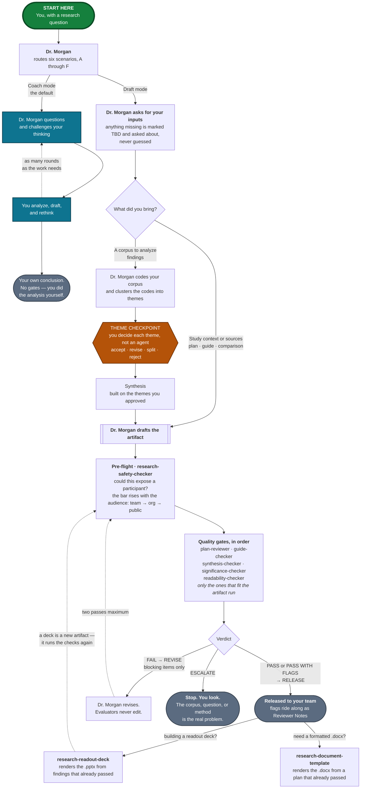

# Dr. Morgan — UX Research Skills & Agents

An invokable UX research mentor for IBM product teams — plus the skills and
evaluator agents that check its work. It ships with **IBM Secure** context filled
in (HashiCorp Vault, Boundary, Consul, and Radar, with the addition of
Terraform), and works on any IBM product once you give it that product's context.

By **Kirsten Hosic**, UX Research Strategy Lead, Security Product Design.

Load the **Dr. Morgan** agent, say what you're working on, and it coaches you
through the research, or drafts the artifact and then picks it apart with you.
**Use IBM Bob**, with Copilot Chat as a fallback.

Dr. Morgan is a senior researcher with a PhD in HCI: asks questions before handing
over answers, argues with weak reasoning, insists that every finding trace back to
evidence you can point to, and cites real, checkable literature. It challenges a
senior researcher as a peer and teaches a novice from the fundamentals. Coaching
is the default. Ask for **Draft mode** and it produces a real plan, guide, coding
frame, finding, or matrix, then critiques it with you at the same standard.

Every drafted artifact gets checked before you share it: a safety scan first, then
the quality gates that fit it, with revision capped at two passes before a person
has to look. When Dr. Morgan does the analysis itself, it stops and asks you to
sign off on the themes before anything gets built on top of them. The checks catch
the obvious failures. Judging whether the work is any good is still yours.

Any team at IBM is welcome to use this, on any product. The IBM Secure context is
already filled in and is what Dr. Morgan uses by default. For a different
product, either drop a context file into
[`product-context/`](product-context/) or answer five questions when Dr. Morgan
asks — see [Using this on another product](#using-this-on-another-product). The
rigor doesn't change with the product; only the specificity does.

---

## Quick start

**1. Connect the repo, then invoke the agent.** In IBM Bob, connect this repo so
you can reach the files directly — you can ask Bob to help you do this. Then select
the **Dr. Morgan** agent
([`agents/dr-morgan.agent.md`](agents/dr-morgan.agent.md)) by name and start
talking to it.

No repo connection? Open the agent file, copy the whole thing, and paste it into
Bob or Copilot Chat. That works — but it is not equivalent, and the difference
matters:

> - **A pasted copy has no file access.** Dr. Morgan defers to those files for the
>   things it only summarizes: the verdict schema, the Definition-of-Done rubrics,
>   the 21-item readability rubric, the theme-checkpoint procedure. Pasted, those
>   pointers are dead ends — and the risk isn't a refusal, it's a rubric
>   reconstructed from memory and delivered with the same confidence. Paste the
>   file a gate needs alongside the agent, or run that gate in a session with the
>   repo connected.
> - **Custom instructions beat a first chat message.** Custom instructions are
>   re-applied every turn. A first message is just an early turn, and it gets
>   buried as you paste transcripts in — which is exactly when you're asking for
>   the most rigor. Use the custom-instructions box.

**2. Say what you're working on.** A plain sentence is fine: "I have eight
interviews about Vault's setup flow and I don't know where to start." Dr. Morgan
routes to the right scenario. You can also name one, or switch mid-conversation.

**3. Add your materials when asked** — share a folder with Bob, or paste them in.
Research questions, transcripts, draft guides, competitor notes. Swap participant
names, email addresses, and phone numbers for IDs (P1, P2) first. Roles, account
names, and regions can stay — they're what make a finding actionable, and a
separate check governs where they're allowed to travel. Treat the chat the way
you'd treat any outside tool holding research data.

That's the whole loop for coaching. If you used Draft mode and now have an
artifact you intend to show someone, go to
[Releasing an artifact](#releasing-an-artifact).

### Using this on another product

Generic research advice helps nobody. "Define your participants" is true
everywhere; "your operators and your end users are different people with
different mental models, and this finding conflates them" only lands if Dr.
Morgan knows what an operator is on your product. So it resolves product context
before it gets specific, in this order:

1. **A file in [`product-context/`](product-context/)** matching the product you
   name. That's the durable option, and it means your team writes the context
   once instead of every session.
2. **The default**, [`product-context/ibm-secure.md`](product-context/ibm-secure.md).
3. **Five questions**, asked in conversation, when no file matches or you pasted
   the agent in without repo access: what the product is, who the personas are,
   whether the person who configures it is the person who uses it daily, the key
   workflows, and what constrains recruiting. Dr. Morgan will offer to write your
   answers up as a context file you can contribute back.
4. **Nothing**, if you'd rather not. Dr. Morgan works product-neutral and marks
   what it's missing.

**It won't guess.** With no context it says so and labels the affected guidance
rather than inventing personas — a plausible wrong persona in a research plan is
worse than an obvious gap, because someone will recruit against it.

To add your product: copy
[`product-context/TEMPLATE.md`](product-context/TEMPLATE.md), fill in the four
required fields, and open a pull request.
[`PRODUCT-CONTEXT.md`](PRODUCT-CONTEXT.md) has the format and the rules.

One thing to know if you're outside IBM Secure: Scenario B's recruitment
constraints — routing through PMs, external SMEs as the fallback — describe the
IBM Secure team specifically. A `recruitment reality` section in your context
file overrides them. Without one, Dr. Morgan will ask whether they apply to you
before planning against them.

---

## What you can ask for

Six scenarios. Name one, let Dr. Morgan detect which fits, or move between them as
the work moves. Each also exists as a standalone file that goes deeper than the
agent's condensed copy — load one directly when you already know what you need.
Each file is self-contained, so you never need the others loaded.

| Scenario | Use it when | Deeper file |
|---|---|---|
| **A — Analyze your data** | You have data and need defensible insights. Pushes every finding up the ladder: observation → interpretation → insight → recommendation. | [`analyze_your_data.md`](analyze_your_data.md) |
| **B — Select the best method** | You need the most rigorous method you can actually execute, given who you can reach and what's at stake. | [`select_best_method.md`](select_best_method.md) |
| **C — Build a plan from scratch** | Nothing exists yet. Seven phases in order: frame, questions, participants, method, guide, analysis, output — with depth scaled to the stakes. | [`ux_plan_from_scratch.md`](ux_plan_from_scratch.md) |
| **D — Challenge and refine a plan** | You have a draft and want it stress-tested. Audits the upstream decisions first, then the guide for leading, double-barreled, and hypothetical questions. | [`challenge_and_refine_plan.md`](challenge_and_refine_plan.md) |
| **E — Competitive analysis** | You're comparing two to four products across UX, capability, and market lenses, ending in a verdict tied to a real decision. Includes UI teardowns from sourced screenshots and demo video. | [`competitive_analysis.md`](competitive_analysis.md) |
| **F — Deep qualitative analysis** | Same territory as A, strictest path. Runs a mandatory data-integrity audit for hallucination, confirmation bias, and cherry-picking before any analysis proceeds. | [`qualitative_data_analysis_skill.md`](qualitative_data_analysis_skill.md) |

**A or F?** Both analyze data. A is the quicker guided path and keeps you moving;
F front-loads a mandatory integrity audit for hallucination, confirmation bias, and
cherry-picking before it will analyze anything. Start with A unless verification is
the point. Either way, [`research-synthesis-checker`](agents/research-synthesis-checker.agent.md)
is a different thing again — it never analyzes, it only checks a finished synthesis
against the source, claim by claim.

**Need a deck?** [`research-readout-deck.skill`](research-readout-deck.skill)
renders a findings-first `.pptx` from findings records, validating each one before
it builds a slide and reporting gaps by finding ID. Defaults to IBM theming
(Carbon Design System, IBM Plex). Unzip it to inspect; it needs the separate
**pptx** skill to render. It turns finished findings into slides — if they aren't
synthesized yet, run Scenario A first.

**Need a formatted Word document?** That's the **Research Document Template**
([`skills/research-document-template.py`](skills/research-document-template.py)),
a separate tool Dr. Morgan hands off to. It renders a `.docx` in IBM Secure's
design system and doesn't coach — invoke it as a skill in Bob or run the script
directly. [`skills/README.md`](skills/README.md) has the full documentation and
[`skills/CONFIG-SCHEMA.md`](skills/CONFIG-SCHEMA.md) documents the JSON config it
takes.

---

## The six checkers

Each evaluator verifies one thing and is blind to the rest. That blindness is the
reason there's more than one: a groundedness checker will pass a perfectly-sourced
finding that answers nothing anyone asked, and a significance checker will pass a
decision-relevant finding built on a fabricated quote.

| Agent | Verifies | Cannot see |
|---|---|---|
| [`research-safety-checker`](agents/research-safety-checker.agent.md) | Could this expose a participant, given who will read it? | Whether any of it is true, relevant, or readable |
| [`research-plan-reviewer`](agents/research-plan-reviewer.agent.md) | Will this study answer its question? Does the guide cover it? | Anything post-fieldwork; the wording, order, and repetition inside the guide |
| [`research-guide-checker`](agents/research-guide-checker.agent.md) | Are the questions well-formed, behavioral, non-repeating, and in an order a conversation could follow? | Whether the study is worth running; whether the guide covers the research questions; the moderator, where most leading actually happens |
| [`research-synthesis-checker`](agents/research-synthesis-checker.agent.md) | Is each claim traceable to source text? | Whether the claim matters |
| [`research-significance-checker`](agents/research-significance-checker.agent.md) | Does it map to a question and a decision? Does it reach insight level? Is the corpus complete? | Whether the claim is true |
| [`research-readability-checker`](agents/research-readability-checker.agent.md) | Will a mixed stakeholder audience understand and act on it? Is it free of PII? | Whether any of it is correct |

Each agent's own file carries its detail: what it checks, what blocks versus
flags, and the verdict it emits.

**Two of them read the same discussion guide, and the split is the point.**
`research-plan-reviewer` holds the research questions, so it is the one that can
say whether the guide points at the right targets — every question mapped to a
research question and back again. `research-guide-checker` never sees the
research questions, and reads the guide as a conversation instead: whether a
question leads, doubles up, asks for a prediction where it should ask for a
memory, repeats something asked twenty minutes earlier in different words, or
sits in an order that primes its own answer. Any guide Dr. Morgan drafts runs
this gate before a session is scheduled, because a defect in a guide stops being
fixable the moment the first participant answers the question.

---

## How it fits together

*Green is where you start · teal is coaching · amber is the one stop where you
decide instead of an agent · slate is an end state · dotted arrows loop back.*

---

## How much to trust the output

Everything here is produced by a language model, including the checkers — and
confident, well-formatted prose is what these systems produce when they are wrong
as readily as when they are right. **Read every output the way you would read work
from a contractor you are about to put your name on.** The guardrails below are
worth having. None of them is a substitute for you reading the thing.

**What they do**

- **Make fabrication harder to introduce.** Dr. Morgan is instructed to quote only
  text you provided, use your participant IDs, and cite only verifiable sources,
  and [`research-synthesis-checker`](agents/research-synthesis-checker.agent.md)
  reads the finished synthesis back against the source, claim by claim. That
  catches a great deal — and it is still one language model checking another's
  work. Spot-check quotes against your transcripts: cheapest thing to verify,
  most damaging thing to get wrong.
- **Put weaker evidence on the record.** Proxy evidence — a colleague describing
  customers rather than a customer describing themselves — gets flagged, and
  competitive claims carry `[verified]`, `[vendor claim]`, `[inference]`, or
  `[unknown]`. A missing label means the labeling missed something, not that the
  claim underneath is solid.
- **Add a second pass at participant data, not the first one.** De-identifying
  before you paste is still your job.
  [`research-safety-checker`](agents/research-safety-checker.agent.md) reads the
  artifact against the destination you declared and catches things people miss,
  but it can only flag what it recognizes.
- **Keep the inconvenient findings in.** A finding that falls outside your original
  research questions is kept and flagged rather than cut, and a research question
  that nothing answered is flagged too.
- **Stop where judgment is required.** In Draft mode you review every theme before
  synthesis is built on it. That is where the interpretation gets set, and no
  checker can verify what data means.
- **Catch the guide defects that can't be fixed later.** A leading question, a
  stimulus shown before the unprimed baseline, the same thing asked twice in
  different words — [`research-guide-checker`](agents/research-guide-checker.agent.md)
  reads every drafted guide for these before a session is scheduled, because a
  defect in a guide stops being fixable the moment the first participant answers
  the question. Two caveats it states in its own report and that are worth
  repeating: **it is not a pilot**, and **it cannot see the moderator**. Whether
  a question is ambiguous to an actual practitioner is answered by one pilot
  session, not by review; and most leading happens live, in an unwritten
  follow-up or a silence someone fills with a hypothesis.

**What they can't do**

A `PASS` means nothing blocking was found — not that the study is right.
These checks catch fabrication, irrelevance, incoherence, and opacity; a
well-executed study of the wrong question passes every one of them. LLM evaluators
also grade leniently on text that reads as rigorous, and chained checks compound
false positives, so neither a pass nor a flag proves much on its own. The rest of
the limits are written down in [`EVALUATION-LOOP.md`](EVALUATION-LOOP.md) §7.

---

## Releasing an artifact

Draft-mode artifacts go through the loop before they reach anyone else. Dr. Morgan
runs the loop and tells you which checker comes next — select it by name in Bob,
then bring the verdict back. You don't need to track which gates apply.

**Say where it's going.** The safety scan runs first on everything, and its bar
depends on who will read it. Dr. Morgan asks if you haven't said.

| Destination | Who sees it |
|---|---|
| `internal-team` | The research, design, and product team working on this |
| `internal-org` | Anyone inside IBM — wide channels, org-wide readouts, wikis, tickets |
| `external` | Anyone outside it: customers, conference talks, blog posts, public repos |

It also asks who you talked to, because internal participants carry *more*
permitted detail, not less.

| Participant type | Meaning |
|---|---|
| `customer-direct` | An external customer who is themselves the user |
| `internal-direct` | An IBM employee who is themselves the user |
| `internal-proxy` | An employee describing customers' experience — support, customer success, solution architects, field engineering |
| `sme-external` | An outside subject-matter expert who matches the persona but isn't a customer |

Names, emails, and phone numbers block at every tier. Role, account name, and
region scale with the destination, and stricter consent terms win.

**Then act on the verdict.** `RELEASE` ships it, with any flags attached as
Reviewer Notes for you to weigh. `REVISE` means Dr. Morgan fixes the blocking
items and re-runs that gate — twice at most. `ESCALATE` means stop and look at
it yourself.

Two calls stay yours: the themes, which you accept, revise, split, or reject one
at a time before synthesis is built on them, and whether the artifact actually
ships. Passing the gates isn't approval. A readout deck is a new artifact and
runs the checks again.

The gate matrix, verdict schema, and known limits are in
[`EVALUATION-LOOP.md`](EVALUATION-LOOP.md).

---

## Reference docs

| File | What it's for |
|---|---|
| [`agents/dr-morgan.agent.md`](agents/dr-morgan.agent.md) | The main agent — an `.agent.md` file Bob can load by name. Routes between all six scenarios and switches mid-conversation. Start here. |
| [`EVALUATION-LOOP.md`](EVALUATION-LOOP.md) | How release works: the gate matrix, the verdict shape, the two-pass cap, escalation triggers, Definition of Done per artifact type, and the known limits. Read before adding a skill or evaluator. |
| [`FINDINGS-CONTRACT.md`](FINDINGS-CONTRACT.md) | One shape for a finding, shared by everything that produces or reads one. Because the deck skill can only render fields a record contains, this is what structurally stops evidence from being invented during deck building. |
| [`VOICE-AND-STYLE.md`](VOICE-AND-STYLE.md) | How outputs should read, and the rubric the readability gate scores against. |
| [`DESIGN-SYSTEM.md`](DESIGN-SYSTEM.md) | IBM Secure's output standards: palette, typography, spacing, document structure, and data integrity. Every generated research plan, deck, and analysis output follows it. |
| [`skills/README.md`](skills/README.md) | Driving the Research Document Template: usage, layouts, output, and common scenarios. [`skills/CONFIG-SCHEMA.md`](skills/CONFIG-SCHEMA.md) documents the JSON config. |
| [`PRODUCT-CONTEXT.md`](PRODUCT-CONTEXT.md) | How Dr. Morgan gets specific about your product: the resolution order, the five-question intake, the file format, and how to add your own. [`product-context/`](product-context/) holds the files themselves. |
| [`MAINTAINING.md`](MAINTAINING.md) | Repo upkeep — test fixtures, keeping the agent in sync with the standalone files, and the drift check for shared blocks. Only needed if you're editing the suite, not using it. |

The six scenario files and the six evaluator agents are listed in
[What you can ask for](#what-you-can-ask-for) and
[The six checkers](#the-six-checkers).

<b>Frameworks and canon referenced</b>

The scenarios cite established literature so the guidance is grounded. Full
citations live in the individual files.

**Methods, interviewing, and analysis**
- Erika Hall — *Just Enough Research*
- Steve Portigal — *Interviewing Users*
- Rob Fitzpatrick — *The Mom Test*
- Goodman, Kuniavsky & Moed — *Observing the User Experience*
- Braun & Clarke — *Thematic Analysis*
- Johnny Saldaña — *The Coding Manual for Qualitative Researchers*
- Beyer & Holtzblatt — *Contextual Design*
- Indi Young — *Mental Models*
- John W. Creswell — *Research Design*
- Leah Buley — *The User Experience Team of One*

**Quantitative and measurement**
- Sauro & Lewis — *Quantifying the User Experience* (also the source of the
  SUS ≈ 68 average benchmark and letter grades)
- Tullis & Albert — *Measuring the User Experience*
- Jakob Nielsen / Nielsen Norman Group — usability heuristics, sample-size guidance

**Competitive analysis (Scenario E)**
- Michael E. Porter — *Competitive Strategy* (1980): Five Forces, generic strategies
- Christensen, Hall, Dillon & Duncan — *Competing Against Luck* (2016): Jobs to Be Done
- April Dunford — *Obviously Awesome* (2019): product positioning
- Marty Cagan — *Inspired*: product judgment
- Amy Schade & Tim Neusesser (Nielsen Norman Group) — competitive usability evaluation

<b>Glossary</b> — the words that come from AI tooling, or that this repo uses in a particular way

| Term | What it means here |
|---|---|
| artifact | Anything the suite produces for someone else to read: a research plan, a discussion guide, a findings doc, a competitive analysis, a slide deck. |
| agent | A prompt packaged so a tool can load it by name. The configuration at the top of an `.agent.md` file is called *frontmatter*; you don't need to touch it. |
| skill | A prompt bundled with its supporting files (templates, reference docs, scripts). Bob can invoke one by name. |
| custom instructions | The box in Bob or Copilot Chat where you set standing instructions for a whole conversation instead of retyping them. Sometimes called a system prompt. |
| gate | A checker that reads a finished artifact and reports whether it passes. Five of the six run as quality gates; the safety checker runs ahead of them as pre-flight. Each looks for something different. |
| verdict | The block a gate ends with: **PASS**, **PASS WITH FLAGS**, or **FAIL**, plus what to do next. Written in a fixed shape so a person or a script can act on it without reading prose — in that machine-readable block they appear as `PASS`, `PASS_WITH_FLAGS`, `FAIL`. |
| pre-flight | The safety scan that runs before the gates, on everything, every time. |
| checkpoint | A stop where a *person* decides, not an agent. Two exist: the **theme checkpoint** after clustering (the default one), and a conditional **codebook checkpoint** at the end of coding, run only when the corpus is too large to code in one attentive pass. |
| blocking vs. flagged | Blocking means something is wrong and gets fixed. Flagged means it's accurate but a human should look. |
| altitude | How zoomed-in a claim is. "Operators misunderstand the secret lifecycle" and "the close button is 4px too small" are different altitudes. |
| proxy evidence | Something a colleague told you about customers, as distinct from something a customer told you. |

---

## Repo

- **Repository:** [kirstenhosic/UX-Research-Skills-IBM-Secure](https://github.com/kirstenhosic/UX-Research-Skills-IBM-Secure) *(private)*
- **Clone:** `https://github.com/kirstenhosic/UX-Research-Skills-IBM-Secure.git`
- **Product-agnostic sibling:** [kirstenhosic/UX-Research-Skills](https://github.com/kirstenhosic/UX-Research-Skills) *(private, and not available to IBM teams)*. The same suite, with fill-in PRODUCT CONTEXT placeholders instead of the IBM Secure context, for use outside IBM
- **License:** MIT
- **Author and maintainer:** Kirsten Hosic ([@kirstenhosic](https://github.com/kirstenhosic)), UX Research Strategy Lead, Security Product Design
- **Cite it:** see [`CITATION.cff`](CITATION.cff)
