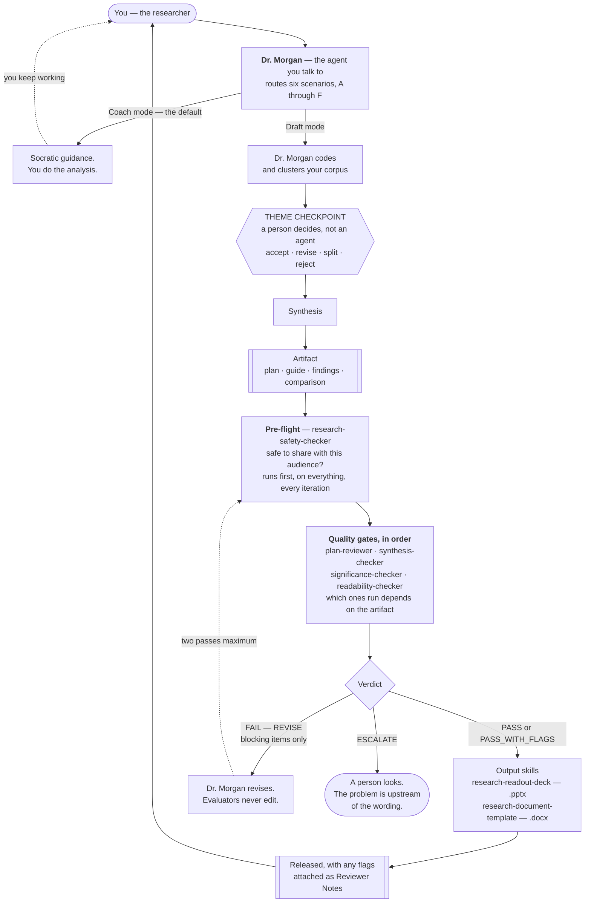

# Dr. Morgan — UX Research Skills & Agents

An invokable UX research mentor for **IBM Secure products:** HashiCorp Vault,
Boundary, Consul, and Radar, with the addition of Terraform, plus the skills and
evaluator agents that check its work.

You load the Dr. Morgan agent, describe what you're working on, and it coaches you
through the research, or drafts the artifact and then picks it apart with you.
**Use IBM Bob**, with Copilot Chat as a fallback. GitHub Copilot in VS Code is not
permitted for this work. That's IBM tooling policy, not a preference.

Dr. Morgan is the mentor: a senior researcher with a PhD in HCI who asks
questions before handing over answers, argues with weak reasoning, insists that
every finding trace back to evidence you can point to, and cites real, checkable
literature. Coaching is the default. Ask for Draft mode and it will produce a real
plan, guide, coding frame, finding, or matrix, then critique it with you at the
same standard.

Nothing here ships unchecked. Anything the suite produces runs an **evaluation
loop**: five independent evaluator agents that verify the work, hand back what's
broken, and cap the retries before a person has to look. And when Dr. Morgan does
the analysis itself, it stops mid-way and asks you to sign off on the themes
before anything gets built on top of them.

The IBM Secure product context is already filled in. Nothing to install, nothing
to configure.

---

## Start here

**1. Connect the repo, then invoke the agent.** In IBM Bob, connect this repo so you
can reach the files directly. You can ask Bob to help you do this. Then select the 
**Dr. Morgan** agent ([`agents/dr-morgan.agent.md`](agents/dr-morgan.agent.md)) by 
name and start talking to it.

No repo connection? Open the agent file, copy the whole thing, and paste it into
Bob or Copilot Chat as custom instructions, or as the first message in a new chat.
The agent behaves the same either way; invoking it is just less friction.

**2. Say what you're working on.** A plain sentence is fine: "I have eight
interviews about Vault's setup flow and I don't know where to start." Dr. Morgan
figures out which of the six scenarios fits and goes from there. You can also name
the scenario yourself, or switch mid-conversation.

**3. Paste your materials when asked.** Research questions, transcripts, draft
guides, competitor notes. Swap participant names, email addresses, and phone
numbers for IDs (P1, P2) before you paste. Roles, account names, and regions can
stay. They're what make a finding actionable, and there's a separate check that
governs where they're allowed to travel. Treat the chat the way you'd treat any
outside tool holding research data.

That's all of it, for coaching. If you asked for Draft mode and now have an
artifact you intend to show someone, keep going to
[How work gets checked](#how-work-gets-checked).

> **Need more depth on one scenario?** Each of the six also exists as a standalone
> file that goes further than the agent's condensed copy of it. Load one directly
> when you already know exactly what you need. Each file is self-contained, so you
> never need the others loaded. See [File reference](#file-reference).

---

## A few terms

Most of the vocabulary here is ordinary research vocabulary. These are the words
that come from AI tooling, or that this repo uses in a particular way.

| Term | What it means here |
|---|---|
| artifact | Anything the suite produces for someone else to read: a research plan, a discussion guide, a findings doc, a competitive analysis, a slide deck. |
| agent | A prompt packaged so a tool can load it by name. The configuration at the top of an `.agent.md` file is called *frontmatter*; you don't need to touch it. |
| skill | A prompt bundled with its supporting files (templates, reference docs, scripts). Bob can invoke one by name. |
| custom instructions | The box in Bob or Copilot Chat where you set standing instructions for a whole conversation instead of retyping them. Sometimes called a system prompt. |
| gate | A checker that reads a finished artifact and reports whether it passes. There are five, and each looks for something different. |
| verdict | The block a gate ends with: `PASS`, `PASS_WITH_FLAGS`, or `FAIL`, plus what to do next. Written in a fixed shape so a person or a script can act on it without reading prose. |
| pre-flight | The safety scan that runs before the gates, on everything, every time. |
| checkpoint | A stop where a *person* decides, not an agent. There's exactly one: the theme checkpoint. |
| blocking vs. flagged | Blocking means something is wrong and gets fixed. Flagged means it's accurate but a human should look. |
| altitude | How zoomed-in a claim is. "Operators misunderstand the secret lifecycle" and "the close button is 4px too small" are different altitudes. |
| proxy evidence | Something a colleague told you about customers, as distinct from something a customer told you. |

---

## How it fits together



Rounded boxes are people. The hexagon is the one place a person decides instead of
an agent. Dotted arrows are loops back.

Two things the shape of this is meant to show. Coach mode never leaves the top of
the diagram. No gates run there, because you did the work and there's no draft to
verify. And every path out of `Verdict` ends with a person: release is your call,
revision is capped at two passes, and escalation goes straight to you.

---

## What Dr. Morgan can help with

Six scenarios. Name one, let Dr. Morgan detect which fits, or move between them
as the work moves.

- **A — Analyze your data.** You have data and need defensible insights. Pushes
  every finding up the ladder from observation to interpretation to insight to
  recommendation.
- **B — Select the best method.** Recommends the most rigorous method you can
  execute, given who you can get access to and what's at stake.
- **C — Build a plan from scratch.** Seven phases in order: frame, questions,
  participants, method, guide, analysis, output. Depth scales to the size and
  stakes of the study.
- **D — Challenge and refine a plan.** Stress-tests a draft you already have.
  Audits the upstream decisions, then reviews the discussion guide for leading,
  double-barreled, and hypothetical questions.
- **E — Competitive analysis.** Compares two to four products across UX,
  capability, and market lenses, ending in a verdict tied to a real decision.
  Includes side-by-side UI teardowns built from sourced screenshots, product-tour
  pages, and demo video.
- **F — Deep qualitative analysis.** Same territory as A, strictest path. Runs a
  mandatory data-integrity audit for hallucination, confirmation bias, and
  cherry-picking before any analysis proceeds.

Need a formatted Word document out the other end? That's the **Research Document
Template Generator**, a separate tool Dr. Morgan hands off to. It renders a
`.docx` from your content and doesn't coach. [`skills/README.md`](skills/README.md)
has the details.

---

## Design system

Every research document the skills in this repo generate (research plans, readout
decks, analysis outputs) follows IBM Secure's design system.
[`DESIGN-SYSTEM.md`](DESIGN-SYSTEM.md) holds the standards:

- Color palette (primary and secondary blue, light gray)
- Typography and spacing
- Document structure requirements
- Data integrity standards

[`skills/README.md`](skills/README.md) covers how to drive the document generator,
and [`skills/CONFIG-SCHEMA.md`](skills/CONFIG-SCHEMA.md) documents the JSON config
it takes.

---

## The through-line: integrity over confidence

Every scenario holds one bar. **A confident wrong answer is worse than an honest
"I don't know."** It shows up three ways.

**Data integrity.** Findings trace to specific evidence with participant IDs.
Confirmation bias and cherry-picking get named out loud. Analysis from memory
isn't allowed.

**Provenance integrity.** Each piece of evidence records who the participant was.
When an internal colleague describes *customers'* experience, that's secondhand. It
establishes what they believe about customers, which is a different claim from
what customers do. Ordinary traceability can't tell the two apart, so the gates
check provenance separately.

**Source integrity**, in Scenario E. Every claim carries a label:
`[verified]`, `[vendor claim]`, `[inference]`, or `[unknown]`. A vendor saying it
does something is a claim until corroborated. Volatile data gets dated. Citations
are never invented. Visual evidence gets the same treatment. Screenshots and clips
are labeled by source type (`[live product]`, `[marketing]`, `[demo video]`,
`[third party]`) and dated, and UX never gets scored from marketing imagery
alone.

---

## How work gets checked

Dr. Morgan drafts. A safety scan and up to three quality gates check. Dr. Morgan
revises the blocking items. You decide. The diagram in
[How it fits together](#how-it-fits-together) shows the whole path; this section is
the reasoning behind it.

### A person reviews the themes first

Every gate in this suite runs on a finished artifact. That means none of them
looks at the stage where the interpretive commitments get made. In Draft
mode Dr. Morgan codes the corpus and clusters the codes, so the checkpoint stops
there and asks you for a decision on each theme (accept, revise, split, or reject)
before synthesis builds anything on top.

No agent runs it. An LLM judging an LLM's themes is a second opinion drawn from
the same blind spots.

Coach mode is exempt, since you did the clustering yourself. Flagged at
`internal-team`; blocking at `internal-org` and `external`. Details in
[`EVALUATION-LOOP.md`](EVALUATION-LOOP.md) §9.

### Safety runs first, on everything

Not last, and not queued inside the ordered sequence. The quality gates stop at
the first failure, so a safety scan placed last would never run at all on an
artifact that failed groundedness. Identifying data could sit undiscovered through two full revision cycles, on the one check that's never negotiable.

The scan knows two things about your artifact.

**Where it's going:**

| Destination | Who sees it |
|---|---|
| `internal-team` | The research, design, and product team working on this |
| `internal-org` | Anyone inside IBM — wide channels, org-wide readouts, wikis, tickets |
| `external` | Anyone outside it: customers, conference talks, blog posts, public repos |

**Who you talked to:**

| Participant type | Meaning |
|---|---|
| `customer-direct` | An external customer who is themselves the user |
| `internal-direct` | An IBM employee who is themselves the user |
| `internal-proxy` | An employee describing customers' experience — support, customer success, solution architects, field engineering |
| `sme-external` | An outside subject-matter expert who matches the persona but isn't a customer |

Internal participants carry *more* permitted detail, not less: role, product
area, and region are how a colleague's perspective becomes interpretable. Names,
email addresses, and phone numbers block for everyone at every tier.

Destination matters because the bar for a team readout isn't the bar for a
conference talk. Apply the external bar to internal work and you'll block
ordinary research over an account name the whole team already knows. Inside IBM,
"an SRE at Contoso Financial" is a category of user at a category of customer.
Where the study's consent terms are stricter than the destination allows, consent
wins. That's what participants were promised, and an office norm has no standing
to relax it.

### Then the quality gates, in order

Which gates apply depends on what you made. [`EVALUATION-LOOP.md`](EVALUATION-LOOP.md)
§3 has the matrix, and it lives only there.

Order matters: groundedness, then significance, then readability. A `FAIL` stops
the sequence. There's no point asking whether a finding matters, or polishing how
it reads, before you know it's supported.

Three more rules govern the loop:

- **Evaluators never edit.** An evaluator that rewrites its own input and then
  re-checks its own rewrite launders its errors past itself. Revision goes back to
  the producer, scoped to the blocking items alone.
- **Two revision passes, then a person looks.** An artifact that can't clear the
  bar in two tries has a problem upstream of the wording: the data, the question,
  or the method.
- **Blocking and flagged are different.** Blocking means the artifact asserts
  something untrue, unsupported, or unsafe; it gets fixed. Flagged means the
  artifact is accurate but a human should look, and it ships with the flags
  attached as Reviewer Notes. A gate that treats judgment calls as defects trains
  researchers to delete interesting things to make it go green.

### What the gates deliberately don't delete

Coverage gets checked in both directions. A finding that maps to none of your
stated research questions is kept and flagged, because unplanned findings are often
most valuable thing in a study. A research question that no finding addressed is
flagged too, so you can choose between a follow-up, recovering it from the
corpus, or rewriting the question. Both gaps travel to the readout.

Proxy evidence always gets flagged. "Customers find X confusing — P3" passes
every groundedness check if P3 said exactly that, so ordinary traceability is
blind to it. The gates catch the phrasing and require the scope line to name the
proxy.

The limits are written down too: LLM evaluators grade leniently on text that
reads rigorous, chained gates compound false positives, a hand-built answer key is
the most likely thing in the room to be wrong, and passing every gate doesn't make
a study correct. See [`EVALUATION-LOOP.md`](EVALUATION-LOOP.md) §7.

---

## Writing that reads human

Artifacts get gated on how they read, because a findings document that sounds
generated gets treated as input instead of as a conclusion. It reads as un-owned.
Nobody argues with it, which feels like agreement and isn't.

[`VOICE-AND-STYLE.md`](VOICE-AND-STYLE.md) is the full standard, scored as a
21-item rubric. The short version:

- Vary sentence length. Uniform rhythm is the strongest single tell.
- Quantify exactly — "6 of 8." Precision is a human trait; vagueness is what
  reads generated.
- Keep one telling detail that could only come from being in the room: the paper
  cheat sheet, the fourteen open tabs. Unfakeable, and it survives the meeting.
- Give the strong finding more room. Equal-sized sections for unequal evidence
  hide which finding matters.
- State your confidence, and what would change your mind, in your own voice.
- Commit to a conclusion. Don't balance every criticism with a compensating
  positive.
- Mark the altitude. The failure mode specific to mixed-stakeholder documents is
  jumping between "operators' mental model of the secret lifecycle" and "the modal
  close target is small" with no signal.
- Write the finding once, then add a short "what this means for you" per audience
  (engineers, PMs, designers, researchers, customer reps). Keep it to one
  document; splitting into five guarantees four go stale.

Most advice about sounding human makes writing worse, so the standard also says
what to skip: don't fake casualness, don't add deliberate errors, don't panic
about em-dashes (uniformity is the tell, punctuation isn't), don't manufacture
opinions, don't strip precision to sound conversational.

---

## What every scenario does, regardless

- Calibrates to your experience. Challenges a senior researcher as a peer;
  teaches a novice from fundamentals.
- Runs in two modes: Coach (Socratic, the default) and Draft (produces a real
  artifact, then critiques it with you).
- Never fabricates data. Quotes only verbatim text you provided, with your
  participant IDs, and asks for what's missing instead of reconstructing it.
- Never fabricates sources or overstates numbers. Cites only verifiable sources,
  and frames every sample-size rule or benchmark as a rule of thumb with its
  assumptions attached.
- Protects participant data. Prompts you to de-identify transcripts before you
  paste, and flags personal data it notices.

---

## File reference

Two ways in: the Dr. Morgan agent, which routes between all six scenarios, or a
single standalone scenario file when you already know what you need. The
standalone files are the deeper versions; the agent carries a condensed copy of
each.

| File | What it is | Open it when |
|---|---|---|
| [`agents/dr-morgan.agent.md`](agents/dr-morgan.agent.md) | The main agent — an `.agent.md` file Bob can load by name. Routes between all six scenarios and switches mid-conversation. | You want one agent for a whole research effort. |
| [`EVALUATION-LOOP.md`](EVALUATION-LOOP.md) | How an artifact gets released: which gates run on what, the verdict shape, the revision cycle and its two-pass cap, escalation triggers, and the Definition of Done per artifact type. | You want to know how release works, or you're adding a skill or evaluator. |
| [`FINDINGS-CONTRACT.md`](FINDINGS-CONTRACT.md) | One shape for a finding, shared by everything that produces or reads one. Because the deck skill can only render fields a record contains, this is what structurally stops evidence from being invented during deck building. | You're synthesizing findings, or building anything that reads them. |
| [`VOICE-AND-STYLE.md`](VOICE-AND-STYLE.md) | How outputs should read, and the 21-item rubric the readability gate scores against. | Any artifact a stakeholder will open. |
| [`DESIGN-SYSTEM.md`](DESIGN-SYSTEM.md) | IBM Secure's output standards: palette, typography, spacing, document structure, data integrity. | You're generating or reviewing a formatted document. |
| [`agents/research-safety-checker.agent.md`](agents/research-safety-checker.agent.md) | Pre-flight: is this safe to share? Calibrated to where the artifact is going and who the participants were. | Every artifact, first, every iteration. |
| [`agents/research-synthesis-checker.agent.md`](agents/research-synthesis-checker.agent.md) | Gate 1: is it true? Cross-checks every claim, quote, and statistic against the source. | Any draft synthesis, competitive analysis, or readout deck. |
| [`agents/research-significance-checker.agent.md`](agents/research-significance-checker.agent.md) | Gate 2: does it matter? Question coverage both ways, insight altitude, decision-fit, scope, and whether a person reviewed the themes. | After gate 1 passes on a findings set. |
| [`agents/research-plan-reviewer.agent.md`](agents/research-plan-reviewer.agent.md) | The plan gate: will this study work? The only gate that runs before the money is spent. | Any research plan or discussion guide, before fieldwork. |
| [`agents/research-readability-checker.agent.md`](agents/research-readability-checker.agent.md) | The last gate: can a mixed room act on it? Scored against `VOICE-AND-STYLE.md`. | Every artifact, last, before it leaves the team. |
| [`ux_plan_from_scratch.md`](ux_plan_from_scratch.md) | Scenario C, in full. Seven phases, with depth calibrated to the study's stakes (lightweight, standard, or high-stakes). | You're starting a new study with nothing yet. |
| [`select_best_method.md`](select_best_method.md) | Scenario B, in full. Built around the Minimum Viable Research Method and your real recruitment constraints. | You need the most rigorous method you can run. |
| [`analyze_your_data.md`](analyze_your_data.md) | Scenario A, in full. Six stages, with guardrails for quantitative data (distributions, small-n confidence, significance vs. importance). The quick path. In Draft mode it stops at the theme checkpoint. | You have data and need defensible insights. |
| [`challenge_and_refine_plan.md`](challenge_and_refine_plan.md) | Scenario D, in full. Rapid upstream audit plus script review — and it knows when to stop refining and send you back to Scenario C for a redesign. | You have a draft and want it stress-tested. |
| [`competitive_analysis.md`](competitive_analysis.md) | Scenario E, in full. Tiered templates (a core three, plus six you add when they earn it), a source-integrity audit, and a visual-evidence workflow for comparing competitor UI. | You're comparing products to inform a design, positioning, or roadmap call. Run the safety pre-flight and the synthesis checker in source-integrity mode before sharing the output. |
| [`qualitative_data_analysis_skill.md`](qualitative_data_analysis_skill.md) | Scenario F, in full. Mandatory data-integrity audit before any analysis, and a theme checkpoint after clustering. | Analysis quality control is the priority. |
| [`research-readout-deck.skill`](research-readout-deck.skill) | Artifact generator, packaged as a skill bundle — unzip to inspect. Renders a findings-first `.pptx` for a mixed product-team audience from findings records, validating them before it builds a slide and reporting gaps by finding ID. Handed raw notes, it says what that costs: `disconfirming`, `limits`, and `confidence` can't be recovered at deck-build time. Defaults to IBM theming (Carbon Design System, IBM Plex). Needs the separate **pptx** skill to render. | You've finished a study and need to present it. |
| [`skills/research-document-generator.py`](skills/research-document-generator.py) + configs | The Research Document Template Generator, the single template every generated research document goes through. Produces formatted Word documents in IBM Secure's design system: Cambria, grayish-blue palette, callouts, auto-numbered sections, page numbers. Two layouts: the standard `research-plan` layout (purpose → scope → RQs → participants → guide → timeline → deliverables), and a generic `sections` layout for rationales, briefs, and one-pagers. Customizable through JSON configs. | Any time you're producing a research document as a `.docx` (plan, rationale, or brief). Invoke it as a skill in Bob, or run the script directly. [`skills/README.md`](skills/README.md) has the full documentation. |

Each evaluator's own file carries its detail: what it checks, what blocks versus
flags, the verdict it emits. This table says what each one is for.

---

## Frameworks and canon referenced

The scenarios cite established literature so the guidance is grounded. Full
citations live in the individual files.

**Methods, interviewing, and analysis**
- Erika Hall — *Just Enough Research*
- Steve Portigal — *Interviewing Users*
- Rob Fitzpatrick — *The Mom Test*
- Goodman, Kuniavsky & Moed — *Observing the User Experience*
- Braun & Clarke — *Thematic Analysis*
- Johnny Saldaña — *The Coding Manual for Qualitative Researchers*
- Beyer & Holtzblatt — *Contextual Design*
- Indi Young — *Mental Models*
- John W. Creswell — *Research Design*
- Leah Buley — *The User Experience Team of One*

**Quantitative and measurement**
- Sauro & Lewis — *Quantifying the User Experience: Practical Statistics for User
  Research* (also the source of the SUS ≈ 68 average benchmark and letter grades)
- Tullis & Albert — *Measuring the User Experience*
- Jakob Nielsen / Nielsen Norman Group — usability heuristics, sample-size
  guidance

**Competitive analysis (Scenario E)**
- Michael E. Porter — *Competitive Strategy* (1980): Five Forces, generic
  strategies
- Christensen, Hall, Dillon & Duncan — *Competing Against Luck* (2016): Jobs to
  Be Done
- April Dunford — *Obviously Awesome* (2019): product positioning
- Marty Cagan — *Inspired*: product judgment
- Amy Schade & Tim Neusesser (Nielsen Norman Group) — competitive usability
  evaluation

---

## Running the gates yourself

Releasing an artifact to other people takes three steps.

1. Run `research-safety-checker` first, on every artifact, and tell it where the
   artifact is going (`internal-team`, `internal-org`, or `external`). It will ask
   if you don't. This runs before everything else, every iteration.
2. Run the quality gates in order, stopping at the first `FAIL`. Which ones apply
   depends on what you made. See [`EVALUATION-LOOP.md`](EVALUATION-LOOP.md) §3.
3. Act on the verdict. `REVISE` means fix the blocking items only, then re-run
   that gate. `RELEASE` means ship it, with any flags attached as Reviewer Notes.
   `ESCALATE` means stop, because the problem isn't the wording.

---

## For maintainers

Everything below is repo upkeep. Skip it if you're here to use the skills.

**Tooling is policy, not preference.** Bob is the tool for this work and Copilot
Chat is an acceptable fallback, but GitHub Copilot in VS Code is not permitted.
An earlier version of this README called the agent "a VS Code `.agent.md` file".
Don't reintroduce that framing.

**Test fixtures live in a separate repo.** Before you change a gate, a rubric, or
`EVALUATION-LOOP.md`, run the fixtures in
[kirstenhosic/UX-Research-Skills-testing](https://github.com/kirstenhosic/UX-Research-Skills-testing).
`gate-fixture/` is the one that came from here: 13 planted defects, an answer key,
and named controls that must not trigger. It's what caught the safety-scan ordering
flaw.

**Consistent persona and format.** Every file uses Dr. Morgan and the same plain
instruction opener (`For this conversation, you are Dr. Morgan…`).

**Intentional overlap.** Scenario A and `qualitative_data_analysis_skill.md` both
cover analysis. Keep both: the skill is the stricter integrity-first deep dive
with a mandatory audit before any analysis, and Scenario A is the quicker guided
path.

**Three analysis-integrity files, three jobs.** Easy to confuse, so:

- [`analyze_your_data.md`](analyze_your_data.md) (Scenario A) *guides you to*
  insights through six stages. Coaching-forward; integrity matters, but the
  emphasis is forward motion.
- [`qualitative_data_analysis_skill.md`](qualitative_data_analysis_skill.md) (the
  skill) *audits, then analyzes*. Mandatory data-integrity audit for hallucination,
  confirmation bias, and cherry-picking before it continues into synthesis.
- [`agents/research-synthesis-checker.agent.md`](agents/research-synthesis-checker.agent.md)
  (the agent) is a *pure verifier*. Cross-checks a finished synthesis against the
  source and reports Supported / Partially Supported / Unsupported per claim. It
  never analyzes or rewrites. Use it after synthesis to fact-check, then again
  after deck drafting as a final pass.

**`research-readout-deck.skill` and Scenario A serve different phases.** Scenario
A is analysis: raw data to defensible insights. The deck skill is output:
finished findings to slides. Run Scenario A first if the findings aren't
synthesized yet.

**Five evaluators, five jobs, each blind to the others'.** That blindness is the
reason there's more than one. A groundedness checker will pass a perfectly-sourced
finding that answers nothing anyone asked. A significance checker will pass a
decision-relevant finding built on a fabricated quote. Neither notices a
participant's real name in the appendix.

| Agent | Verifies | Cannot see |
|---|---|---|
| `research-safety-checker` | Is this safe to share with *this* audience? | Whether any of it is true, relevant, or readable |
| `research-synthesis-checker` | Is each claim traceable to source text? | Whether the claim matters |
| `research-significance-checker` | Does it map to a question and a decision? Does it reach insight level? Is the corpus complete? | Whether the claim is true |
| `research-plan-reviewer` | Will this study answer its question? Is the guide sound? | Anything post-fieldwork |
| `research-readability-checker` | Will a mixed audience understand and act on it? | Whether any of it is correct, and whether it's safe to share |

**Keep the agent in sync.** `agents/dr-morgan.agent.md` embeds condensed copies of
each scenario, so a change to a standalone file needs mirroring into the agent.
Or treat the agent as canonical and regenerate the standalones. They will drift
otherwise.

**Shared blocks are duplicated on purpose.** Each scenario file has to be
self-contained so it can be pasted into a chat alone, which means the
`OPERATING PRINCIPLES` block (calibrate to experience · Coach/Draft modes · never
fabricate data · never fabricate sources · protect participant data) is repeated
verbatim in every skill file. That's the cost of portability. When you edit that
block, mirror it to all skill files, or pick one as canonical and regenerate the
rest. Same goes for the `RELEASE GATE` / `REVISION PROTOCOL` / `COVERAGE` /
`VOICE` block appended to each one.

Quick drift check, run from the repo root. Each block should report `OK`, and the
file names beside each hash make a mismatch diagnosable:

````
check() {
  echo "--- $1"
  for f in *.md; do
    b=$(awk -v s="$1" -v e="$2" 'index($0,s)==1{p=1} e!="" && index($0,e)==1{p=0} p' "$f")
    [ -n "$b" ] && printf '%s  %s\n' "$(printf '%s' "$b" | md5)" "$f"
  done | sort > /tmp/_d
  cat /tmp/_d
  n=$(cut -d' ' -f1 /tmp/_d | sort -u | wc -l | tr -d ' ')
  [ "$n" = 1 ] && echo "    OK — identical across $(wc -l < /tmp/_d | tr -d ' ') files" \
                || echo "    DRIFT — $n variants"
}
check 'OPERATING PRINCIPLES (apply throughout' 'MENTORING RULES'
check 'RELEASE GATE (apply to every artifact' ''
````

Literal prefix matching, no regex, no GNU-only flags. It runs as-is on macOS.

This covers the six standalone scenario files only. `agents/dr-morgan.agent.md`
carries the same guidance in markdown rather than plain text, so it can't be
hashed against them. It's the file most likely to drift, and it has to be checked
by reading.

---

## Repo

- **Repository:** [kirstenhosic/UX-Research-Skills-IBM-Secure](https://github.com/kirstenhosic/UX-Research-Skills-IBM-Secure) *(private)*
- **Clone:** `https://github.com/kirstenhosic/UX-Research-Skills-IBM-Secure.git`
- **Product-agnostic sibling:** [kirstenhosic/UX-Research-Skills](https://github.com/kirstenhosic/UX-Research-Skills). The same suite, with fill-in PRODUCT CONTEXT placeholders instead of the IBM Secure context, for use outside this team
- **License:** MIT
- **Maintainer:** [@kirstenhosic](https://github.com/kirstenhosic)
