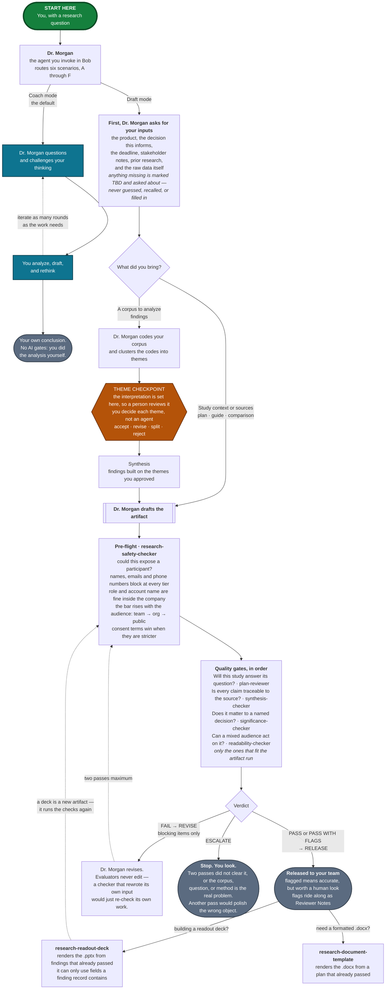

# Dr. Morgan — UX Research Skills & Agents

An invokable UX research mentor for **IBM Secure products** — HashiCorp Vault,
Boundary, Consul, and Radar, with the addition of Terraform — plus the skills and
evaluator agents that check its work.

Load the **Dr. Morgan** agent, say what you're working on, and it coaches you
through the research, or drafts the artifact and then picks it apart with you.
**Use IBM Bob**, with Copilot Chat as a fallback. 

Dr. Morgan is a senior researcher with a PhD in HCI: asks questions before handing
over answers, argues with weak reasoning, insists that every finding trace back to
evidence you can point to, and cites real, checkable literature. Coaching is the
default. Ask for **Draft mode** and it produces a real plan, guide, coding frame,
finding, or matrix, then critiques it with you at the same standard.

Nothing here ships unchecked. Every drafted artifact runs a safety scan and the
quality gates that fit it, revision is capped at two passes before a person has to
look, and when Dr. Morgan does the analysis itself it stops and asks you to sign
off on the themes before anything gets built on top of them.

The IBM Secure product context is already filled in. Nothing to install, nothing
to configure.

---

## Quick start

**1. Connect the repo, then invoke the agent.** In IBM Bob, connect this repo so
you can reach the files directly — you can ask Bob to help you do this. Then select
the **Dr. Morgan** agent
([`agents/dr-morgan.agent.md`](agents/dr-morgan.agent.md)) by name and start
talking to it.

No repo connection? Open the agent file, copy the whole thing, and paste it into
Bob or Copilot Chat. That works — but it is not equivalent, and the difference
matters:

> - **A pasted copy has no file access.** Dr. Morgan defers to those files in nine
>   places for things it only summarizes: the verdict schema, the
>   Definition-of-Done rubrics, the 21-item readability rubric, the
>   theme-checkpoint procedure. Pasted, those pointers are dead ends — and the risk
>   isn't a refusal, it's a rubric reconstructed from memory and delivered with the
>   same confidence. Paste the file a gate needs alongside the agent, or run that
>   gate in a session with the repo connected.
> - **Custom instructions beat a first chat message.** Custom instructions are
>   re-applied every turn. A first message is just an early turn, and it gets
>   buried as you paste transcripts in — which is exactly when you're asking for
>   the most rigor. Use the custom-instructions box.

**2. Say what you're working on.** A plain sentence is fine: "I have eight
interviews about Vault's setup flow and I don't know where to start." Dr. Morgan
routes to the right scenario. You can also name one, or switch mid-conversation.

**3. Share a folder with Bob or paste your materials when asked.** Research questions, transcripts, draft
guides, competitor notes. Swap participant names, email addresses, and phone
numbers for IDs (P1, P2) before you paste. Roles, account names, and regions can
stay — they're what make a finding actionable, and a separate check governs where
they're allowed to travel. Treat the chat the way you'd treat any outside tool
holding research data.

That's the whole loop for coaching. If you used Draft mode and now have an
artifact you intend to show someone, go to
[Releasing an artifact](#releasing-an-artifact).

---

## What you can ask for

Six scenarios. Name one, let Dr. Morgan detect which fits, or move between them as
the work moves. Each also exists as a standalone file that goes deeper than the
agent's condensed copy — load one directly when you already know what you need.
Each file is self-contained, so you never need the others loaded.

| Scenario | Use it when | Deeper file |
|---|---|---|
| **A — Analyze your data** | You have data and need defensible insights. Pushes every finding up the ladder: observation → interpretation → insight → recommendation. | [`analyze_your_data.md`](analyze_your_data.md) |
| **B — Select the best method** | You need the most rigorous method you can actually execute, given who you can reach and what's at stake. | [`select_best_method.md`](select_best_method.md) |
| **C — Build a plan from scratch** | Nothing exists yet. Seven phases in order: frame, questions, participants, method, guide, analysis, output — with depth scaled to the stakes. | [`ux_plan_from_scratch.md`](ux_plan_from_scratch.md) |
| **D — Challenge and refine a plan** | You have a draft and want it stress-tested. Audits the upstream decisions first, then the guide for leading, double-barreled, and hypothetical questions. | [`challenge_and_refine_plan.md`](challenge_and_refine_plan.md) |
| **E — Competitive analysis** | You're comparing two to four products across UX, capability, and market lenses, ending in a verdict tied to a real decision. Includes UI teardowns from sourced screenshots and demo video. | [`competitive_analysis.md`](competitive_analysis.md) |
| **F — Deep qualitative analysis** | Same territory as A, strictest path. Runs a mandatory data-integrity audit for hallucination, confirmation bias, and cherry-picking before any analysis proceeds. | [`qualitative_data_analysis_skill.md`](qualitative_data_analysis_skill.md) |

**Need a deck?** [`research-readout-deck.skill`](research-readout-deck.skill)
renders a findings-first `.pptx` from findings records, validating each one before
it builds a slide and reporting gaps by finding ID. Defaults to IBM theming
(Carbon Design System, IBM Plex). Unzip it to inspect; it needs the separate
**pptx** skill to render.

**Need a formatted Word document?** That's the **Research Document Template**
([`skills/research-document-template.py`](skills/research-document-template.py)),
a separate tool Dr. Morgan hands off to. It renders a `.docx` in IBM Secure's
design system and doesn't coach — invoke it as a skill in Bob or run the script
directly. [`skills/README.md`](skills/README.md) has the full documentation and
[`skills/CONFIG-SCHEMA.md`](skills/CONFIG-SCHEMA.md) documents the JSON config it
takes.

---

## The five checkers

Each evaluator verifies one thing and is blind to the rest. That blindness is the
reason there's more than one: a groundedness checker will pass a perfectly-sourced
finding that answers nothing anyone asked, and a significance checker will pass a
decision-relevant finding built on a fabricated quote.

| Agent | Verifies | Cannot see |
|---|---|---|
| [`research-safety-checker`](agents/research-safety-checker.agent.md) | Could this expose a participant, given who will read it? | Whether any of it is true, relevant, or readable |
| [`research-plan-reviewer`](agents/research-plan-reviewer.agent.md) | Will this study answer its question? Is the guide sound? | Anything post-fieldwork |
| [`research-synthesis-checker`](agents/research-synthesis-checker.agent.md) | Is each claim traceable to source text? | Whether the claim matters |
| [`research-significance-checker`](agents/research-significance-checker.agent.md) | Does it map to a question and a decision? Does it reach insight level? Is the corpus complete? | Whether the claim is true |
| [`research-readability-checker`](agents/research-readability-checker.agent.md) | Will a mixed stakeholder audience understand and act on it? Is it free of PII? | Whether any of it is correct |

Each agent's own file carries its detail: what it checks, what blocks versus
flags, and the verdict it emits.

---

## How it fits together



*Green is where you start · teal is coaching · amber is the one stop where you
decide instead of an agent · slate nodes are end states · dotted arrows loop back.*

---

## Why you can trust the output

One bar holds across every scenario: **a confident wrong answer is worse than an
honest "I don't know."** In practice that means Dr. Morgan:

- **Never fabricates data.** Quotes only verbatim text you provided, with your
  participant IDs, and asks for what's missing instead of reconstructing it.
- **Never fabricates sources or overstates numbers.** Cites only verifiable
  sources, and frames every sample-size rule or benchmark as a rule of thumb with
  its assumptions attached.
- **Separates firsthand from secondhand.** A colleague describing *customers'*
  experience establishes what they believe about customers, which is a different
  claim. Ordinary traceability can't tell the two apart, so proxy evidence is
  always flagged and the scope line has to name it.
- **Labels every competitive claim.** `[verified]`, `[vendor claim]`,
  `[inference]`, or `[unknown]`; volatile data gets dated; screenshots are tagged
  by source type, and UX is never scored from marketing imagery alone.
- **Protects participant data.** Prompts you to de-identify before you paste, and
  flags personal data it notices.
- **Calibrates to you.** Challenges a senior researcher as a peer; teaches a
  novice from fundamentals.

And the loop that enforces it:

- **Safety runs first, on everything, every iteration.** Not last. The quality
  gates stop at the first failure, so a safety scan placed last would never run on
  an artifact that failed groundedness — and identifying data could sit
  undiscovered through two full revision cycles.
- **Gates run in a fixed order:** groundedness, then significance, then
  readability. A `FAIL` stops the sequence. No point asking whether a finding
  matters before you know it's supported.
- **Evaluators never edit.** An evaluator that rewrites its own input and then
  re-checks its own rewrite launders its errors past itself. Revision goes back to
  Dr. Morgan, scoped to the blocking items alone.
- **Two revision passes, then a person looks.** An artifact that can't clear the
  bar in two tries has a problem upstream of the wording.
- **Blocking and flagged are different.** Blocking means untrue, unsupported, or
  unsafe, and gets fixed. Flagged means accurate but worth a human look, and ships
  with the flags attached as Reviewer Notes. A gate that treats judgment calls as
  defects trains researchers to delete interesting things to make it go green.
- **Nothing is deleted for being inconvenient.** A finding that maps to none of
  your research questions is kept and flagged — unplanned findings are often the
  most valuable thing in a study. A question no finding addressed is flagged too.
  Both gaps travel to the readout.
- **A person reviews the themes.** In Draft mode, Dr. Morgan stops after
  clustering and asks you to accept, revise, split, or reject each theme before
  synthesis builds on it. No agent runs this: an LLM judging an LLM's themes is a
  second opinion drawn from the same blind spots.
- **The limits are written down.** LLM evaluators grade leniently on text that
  reads rigorous, chained gates compound false positives, and passing every gate
  doesn't make a study correct. See
  [`EVALUATION-LOOP.md`](EVALUATION-LOOP.md) §7.

---

## Releasing an artifact

Anything you drafted in Draft mode gets checked before you share it. Dr. Morgan
runs the loop and tells you which checker comes next — select it by name in Bob,
then bring the verdict back. You don't need to track which gates apply.

**Say where it's going.** The safety scan runs first on everything, and its bar
depends on who will read it. Dr. Morgan asks if you haven't said.

| Destination | Who sees it |
|---|---|
| `internal-team` | The research, design, and product team working on this |
| `internal-org` | Anyone inside IBM — wide channels, org-wide readouts, wikis, tickets |
| `external` | Anyone outside it: customers, conference talks, blog posts, public repos |

It also asks who you talked to, because internal participants carry *more*
permitted detail, not less.

| Participant type | Meaning |
|---|---|
| `customer-direct` | An external customer who is themselves the user |
| `internal-direct` | An IBM employee who is themselves the user |
| `internal-proxy` | An employee describing customers' experience — support, customer success, solution architects, field engineering |
| `sme-external` | An outside subject-matter expert who matches the persona but isn't a customer |

Names, emails, and phone numbers block at every tier. Role, account name, and
region scale with the destination, and stricter consent terms win.

**Then act on the verdict.** `RELEASE` ships it, with any flags attached as
Reviewer Notes for you to weigh. `REVISE` means Dr. Morgan fixes the blocking
items and re-runs that gate — twice at most. `ESCALATE` means stop and look at
it yourself.

Two calls stay yours: the themes, which you accept, revise, split, or reject one
at a time before synthesis is built on them, and whether the artifact actually
ships. Passing the gates isn't approval. A readout deck is a new artifact and
runs the checks again.

The gate matrix, verdict schema, and known limits are in
[`EVALUATION-LOOP.md`](EVALUATION-LOOP.md).

---

## Reference docs

| File | What it's for |
|---|---|
| [`agents/dr-morgan.agent.md`](agents/dr-morgan.agent.md) | The main agent — an `.agent.md` file Bob can load by name. Routes between all six scenarios and switches mid-conversation. Start here. |
| [`EVALUATION-LOOP.md`](EVALUATION-LOOP.md) | How release works: the gate matrix, the verdict shape, the two-pass cap, escalation triggers, Definition of Done per artifact type, and the known limits. Read before adding a skill or evaluator. |
| [`FINDINGS-CONTRACT.md`](FINDINGS-CONTRACT.md) | One shape for a finding, shared by everything that produces or reads one. Because the deck skill can only render fields a record contains, this is what structurally stops evidence from being invented during deck building. |
| [`VOICE-AND-STYLE.md`](VOICE-AND-STYLE.md) | How outputs should read, and the rubric the readability gate scores against. |
| [`DESIGN-SYSTEM.md`](DESIGN-SYSTEM.md) | IBM Secure's output standards: palette, typography, spacing, document structure, and data integrity. Every generated research plan, deck, and analysis output follows it. |
| [`skills/README.md`](skills/README.md) | Driving the Research Document Template: usage, layouts, output, and common scenarios. [`skills/CONFIG-SCHEMA.md`](skills/CONFIG-SCHEMA.md) documents the JSON config. |

The six scenario files and the five evaluator agents are listed in
[What you can ask for](#what-you-can-ask-for) and
[The five checkers](#the-five-checkers).

<details>
<summary><b>Frameworks and canon referenced</b></summary>

The scenarios cite established literature so the guidance is grounded. Full
citations live in the individual files.

**Methods, interviewing, and analysis**
- Erika Hall — *Just Enough Research*
- Steve Portigal — *Interviewing Users*
- Rob Fitzpatrick — *The Mom Test*
- Goodman, Kuniavsky & Moed — *Observing the User Experience*
- Braun & Clarke — *Thematic Analysis*
- Johnny Saldaña — *The Coding Manual for Qualitative Researchers*
- Beyer & Holtzblatt — *Contextual Design*
- Indi Young — *Mental Models*
- John W. Creswell — *Research Design*
- Leah Buley — *The User Experience Team of One*

**Quantitative and measurement**
- Sauro & Lewis — *Quantifying the User Experience* (also the source of the
  SUS ≈ 68 average benchmark and letter grades)
- Tullis & Albert — *Measuring the User Experience*
- Jakob Nielsen / Nielsen Norman Group — usability heuristics, sample-size guidance

**Competitive analysis (Scenario E)**
- Michael E. Porter — *Competitive Strategy* (1980): Five Forces, generic strategies
- Christensen, Hall, Dillon & Duncan — *Competing Against Luck* (2016): Jobs to Be Done
- April Dunford — *Obviously Awesome* (2019): product positioning
- Marty Cagan — *Inspired*: product judgment
- Amy Schade & Tim Neusesser (Nielsen Norman Group) — competitive usability evaluation

</details>

<details>
<summary><b>Glossary</b> — the words that come from AI tooling, or that this repo uses in a particular way</summary>

| Term | What it means here |
|---|---|
| artifact | Anything the suite produces for someone else to read: a research plan, a discussion guide, a findings doc, a competitive analysis, a slide deck. |
| agent | A prompt packaged so a tool can load it by name. The configuration at the top of an `.agent.md` file is called *frontmatter*; you don't need to touch it. |
| skill | A prompt bundled with its supporting files (templates, reference docs, scripts). Bob can invoke one by name. |
| custom instructions | The box in Bob or Copilot Chat where you set standing instructions for a whole conversation instead of retyping them. Sometimes called a system prompt. |
| gate | A checker that reads a finished artifact and reports whether it passes. There are five, and each looks for something different. |
| verdict | The block a gate ends with: **PASS**, **PASS WITH FLAGS**, or **FAIL**, plus what to do next. Written in a fixed shape so a person or a script can act on it without reading prose — in that machine-readable block they appear as `PASS`, `PASS_WITH_FLAGS`, `FAIL`. |
| pre-flight | The safety scan that runs before the gates, on everything, every time. |
| checkpoint | A stop where a *person* decides, not an agent. Two exist: the **theme checkpoint** after clustering (the default one), and a conditional **codebook checkpoint** at the end of coding, run only when the corpus is too large to code in one attentive pass. |
| blocking vs. flagged | Blocking means something is wrong and gets fixed. Flagged means it's accurate but a human should look. |
| altitude | How zoomed-in a claim is. "Operators misunderstand the secret lifecycle" and "the close button is 4px too small" are different altitudes. |
| proxy evidence | Something a colleague told you about customers, as distinct from something a customer told you. |

</details>

---

<details>
<summary><b>For maintainers</b> — repo upkeep. Skip it if you're here to use the skills.</summary>

**Tooling is policy, not preference.** Bob is the tool for this work and Copilot
Chat is an acceptable fallback, but GitHub Copilot in VS Code is not permitted. An
earlier version of this README called the agent "a VS Code `.agent.md` file". Don't
reintroduce that framing.

**Test fixtures live in a separate repo.** Before you change a gate, a rubric, or
`EVALUATION-LOOP.md`, run the fixtures in
[kirstenhosic/UX-Research-Skills-testing](https://github.com/kirstenhosic/UX-Research-Skills-testing).
`gate-fixture/` is the one that came from here: 13 planted defects, an answer key,
and named controls that must not trigger. It's what caught the safety-scan ordering
flaw.

**Consistent persona and format.** Every file uses Dr. Morgan and the same plain
instruction opener (`For this conversation, you are Dr. Morgan…`).

**Three analysis-integrity files, three jobs.** Easy to confuse, so:

- [`analyze_your_data.md`](analyze_your_data.md) (Scenario A) *guides you to*
  insights through six stages. Coaching-forward; integrity matters, but the
  emphasis is forward motion.
- [`qualitative_data_analysis_skill.md`](qualitative_data_analysis_skill.md) (the
  skill) *audits, then analyzes*. Mandatory data-integrity audit for hallucination,
  confirmation bias, and cherry-picking before it continues into synthesis. The
  overlap with Scenario A is intentional — keep both.
- [`agents/research-synthesis-checker.agent.md`](agents/research-synthesis-checker.agent.md)
  (the agent) is a *pure verifier*. Cross-checks a finished synthesis against the
  source and reports Supported / Partially Supported / Unsupported per claim. It
  never analyzes or rewrites. Use it after synthesis to fact-check, then again
  after deck drafting as a final pass.

**`research-readout-deck.skill` and Scenario A serve different phases.** Scenario
A is analysis: raw data to defensible insights. The deck skill is output: finished
findings to slides. Run Scenario A first if the findings aren't synthesized yet.

**Keep the agent in sync.** `agents/dr-morgan.agent.md` embeds condensed copies of
each scenario, so a change to a standalone file needs mirroring into the agent. Or
treat the agent as canonical and regenerate the standalones. They will drift
otherwise.

**Shared blocks are duplicated on purpose.** Each scenario file has to be
self-contained so it can be pasted into a chat alone, which means the
`OPERATING PRINCIPLES` block (calibrate to experience · Coach/Draft modes · never
fabricate data · never fabricate sources · protect participant data) is repeated
verbatim in every skill file. That's the cost of portability. When you edit that
block, mirror it to all skill files, or pick one as canonical and regenerate the
rest. Same goes for the `RELEASE GATE` / `REVISION PROTOCOL` / `COVERAGE` /
`VOICE` block appended to each one.

Quick drift check, run from the repo root. Each block should report `OK`, and the
file names beside each hash make a mismatch diagnosable:

````
check() {
  echo "--- $1"
  for f in *.md; do
    b=$(awk -v s="$1" -v e="$2" 'index($0,s)==1{p=1} e!="" && index($0,e)==1{p=0} p' "$f")
    [ -n "$b" ] && printf '%s  %s\n' "$(printf '%s' "$b" | md5)" "$f"
  done | sort > /tmp/_d
  cat /tmp/_d
  n=$(cut -d' ' -f1 /tmp/_d | sort -u | wc -l | tr -d ' ')
  [ "$n" = 1 ] && echo "    OK — identical across $(wc -l < /tmp/_d | tr -d ' ') files" \
                || echo "    DRIFT — $n variants"
}
check 'OPERATING PRINCIPLES (apply throughout' 'MENTORING RULES'
check 'RELEASE GATE (apply to every artifact' ''
````

Literal prefix matching, no regex, no GNU-only flags. It runs as-is on macOS.

This covers the six standalone scenario files only. `agents/dr-morgan.agent.md`
carries the same guidance in markdown rather than plain text, so it can't be hashed
against them. It's the file most likely to drift, and it has to be checked by
reading — the scenario list in its opening paragraph and its closing sync note are
the two places that go stale first.

</details>

---

## Repo

- **Repository:** [kirstenhosic/UX-Research-Skills-IBM-Secure](https://github.com/kirstenhosic/UX-Research-Skills-IBM-Secure) *(private)*
- **Clone:** `https://github.com/kirstenhosic/UX-Research-Skills-IBM-Secure.git`
- **Product-agnostic sibling:** [kirstenhosic/UX-Research-Skills](https://github.com/kirstenhosic/UX-Research-Skills). The same suite, with fill-in PRODUCT CONTEXT placeholders instead of the IBM Secure context, for use outside this team
- **License:** MIT
- **Maintainer:** [@kirstenhosic](https://github.com/kirstenhosic)
