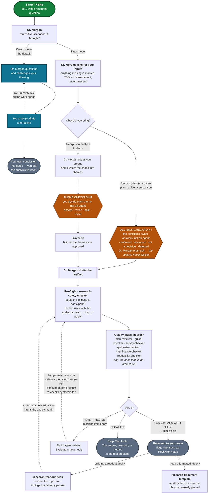

# Dr. Morgan — UX Research Skills & Agents

A UX research mentor you talk to inside **IBM Bob**, plus the checkers that
inspect its work before anyone else sees it. It ships with **IBM Secure**
context filled in (HashiCorp Vault, Boundary, Consul, and Radar, with the
addition of Terraform), and works on any IBM product once you give it that
product's context.

By **Kirsten Hosic**, UX Research Strategy Lead, Security Product Design.

You don't need to have used an AI tool before, and you don't need to code.
You load the **Dr. Morgan** agent, say what you're working on in a plain
sentence, and it coaches you through the research — or drafts the artifact
and then picks it apart with you. **Use IBM Bob**, with Copilot Chat as a
fallback.

Dr. Morgan is a senior researcher with a PhD in HCI: asks questions before
handing over answers, argues with weak reasoning, insists that every finding
trace back to evidence you can point to, and cites real, checkable
literature. It challenges a senior researcher as a peer and teaches a novice
from the fundamentals. Coaching is the default. Ask for **Draft mode** and it
produces a real plan, guide, coding frame, finding, or matrix, then critiques
it with you at the same standard.

Every drafted artifact gets checked before you share it: a safety scan first,
then the quality gates that fit it, with revision capped at two passes before
a person has to look. When Dr. Morgan does the analysis itself, it stops and
asks you to sign off on the themes before anything gets built on top of them.
The checks catch the obvious failures. Judging whether the work is any good
is still yours.

Any team at IBM is welcome to use this, on any product. The IBM Secure
context is already filled in and is what Dr. Morgan uses by default. For a
different product, either drop a context file into
[`product-context/`](product-context/) or answer five questions when Dr.
Morgan asks — see
[Using this on another product](#using-this-on-another-product). The rigor
doesn't change with the product; only the specificity does.

---

## New to AI agents? Read this first

Sixty seconds of orientation. If you've used Bob before, skip to
[Quick start](#quick-start).

Bob is IBM's AI assistant. You type to it in plain English, in a chat window
or in your editor, and it types back. An **agent** is a set of instructions
that turns Bob into a specialist for the length of a conversation. Load Dr.
Morgan — a menu action, nothing technical — and you're talking to a research
mentor instead of a general-purpose assistant.

There is no syntax to learn. "I have eight interviews and I don't know where
to start" is a perfectly good message, and you can't break anything by asking
the wrong question. Do expect pushback, though. Most AI tools agree with
whatever you say; this one asks what decision your research serves before it
helps, and argues when your reasoning is thin. It's supposed to.

One rule before anything else: swap participant names, email addresses, and
phone numbers for IDs (P1, P2) before you paste anything in.

Terms of art — *agent*, *skill*, *gate*, *verdict*, *artifact* — are all
defined in the [Glossary](#glossary) at the bottom.

---

## Quick start

**1. Connect the repo, then invoke the agent.** In IBM Bob, connect this repo
so you can reach the files directly — if you're not sure how, ask Bob itself:
"connect me to the UX-Research-Skills-IBM-Secure repo." Then select the
**Dr. Morgan** agent ([`agents/dr-morgan.agent.md`](agents/dr-morgan.agent.md))
by name and start talking to it.

**2. Say what you're working on.** A plain sentence is fine. Three real
openers, and what happens next:

> *"I have eight interviews about Vault's setup flow and I don't know where
> to start."* → Dr. Morgan routes to analysis and asks about your research
> questions and your transcripts before it touches a theme.
>
> *"My PM wants a survey out this week and I'm not sure a survey is right."*
> → It routes to method selection and asks what decision the data has to
> support.
>
> *"Tear this discussion guide apart before I run sessions on Thursday."* →
> It routes to plan critique, audits the upstream decisions first, then goes
> question by question.

You can also name a scenario outright, or switch mid-conversation. The full
list is in [What you can ask for](#what-you-can-ask-for).

**3. Add your materials when asked** — share a folder with Bob, or paste them
in. Research questions, transcripts, draft guides, competitor notes. **Swap
participant names, email addresses, and phone numbers for IDs (P1, P2)
first.** Roles, account names, and regions can stay — they're what make a
finding actionable, and a separate check governs where they're allowed to
travel. Treat the chat the way you'd treat any outside tool holding research
data.

That's the whole loop for coaching. If you used Draft mode and now have an
artifact you intend to show someone, go to
[Releasing an artifact](#releasing-an-artifact).

### If you can't connect the repo

Open the agent file, copy the whole thing, and paste it into Bob or Copilot
Chat. That works — but it is not equivalent, and the difference matters:

> - **A pasted copy has no file access.** Dr. Morgan defers to those files
>   for the things it only summarizes: the verdict schema, the
>   Definition-of-Done rubrics, the 21-item readability rubric, the
>   theme-checkpoint procedure. Pasted, those pointers are dead ends — and
>   the risk isn't a refusal, it's a rubric reconstructed from memory and
>   delivered with the same confidence. Paste the file a gate needs alongside
>   the agent, or run that gate in a session with the repo connected. For the
>   checkers that file is small on purpose: each one names its excerpt in
>   [`rubrics/`](rubrics/) — the verdict schema plus its own rubric, a few
>   pages instead of all of `EVALUATION-LOOP.md`.
> - **Custom instructions beat a first chat message.** Custom instructions
>   are re-applied every turn. A first message is just an early turn, and it
>   gets buried as you paste transcripts in — which is exactly when you're
>   asking for the most rigor. Use the custom-instructions box.

---

## What you can ask for

Five scenarios. Name one, let Dr. Morgan detect which fits, or move between
them as the work moves. Each also exists as a standalone file that goes
deeper than the agent's condensed copy — load one directly when you already
know what you need. Each file is self-contained, so you never need the
others loaded.

| Scenario | Use it when | Deeper file |
|---|---|---|
| **A — Analyze your data** | You have data and need defensible insights. Pushes every finding up the ladder: observation → interpretation → insight → recommendation. | [`analyze_your_data.md`](analyze_your_data.md) |
| **B — Select the best method** | You need the most rigorous method you can actually execute, given who you can reach and what's at stake. | [`select_best_method.md`](select_best_method.md) |
| **C — Build a plan from scratch** | Nothing exists yet. Seven phases in order: frame, questions, participants, method, guide, analysis, output — with depth scaled to the stakes. | [`ux_plan_from_scratch.md`](ux_plan_from_scratch.md) |
| **D — Challenge and refine a plan** | You have a draft and want it stress-tested. Audits the upstream decisions first, then the guide for leading, double-barreled, and hypothetical questions. | [`challenge_and_refine_plan.md`](challenge_and_refine_plan.md) |
| **E — Competitive analysis** | You're comparing two to four products across UX, capability, and market lenses, ending in a verdict tied to a real decision. Includes UI teardowns from sourced screenshots and demo video. | [`competitive_analysis.md`](competitive_analysis.md) |

**One analysis path.** A used to have a stricter twin you chose between. It's
merged in: the hard rules, the integrity audit, and the per-finding checks
now run on every study, with the audit's depth set by facts about the study
rather than by whether you suspected a problem in your own work. Note that
[`research-synthesis-checker`](agents/research-synthesis-checker.agent.md) is
a different thing again — it never analyzes, it only checks a finished
synthesis against the source, claim by claim.

**Need a deck?** [`research-readout-deck.skill`](research-readout-deck.skill)
renders a findings-first `.pptx` from findings records, validating each one
before it builds a slide and reporting gaps by finding ID. Defaults to IBM
theming (Carbon Design System, IBM Plex). Unzip it to inspect; it needs the
separate **pptx** skill to render. It turns finished findings into slides —
if they aren't synthesized yet, run Scenario A first.

**Need a formatted Word document?** That's the **Research Document Template**
([`skills/research-document-template.py`](skills/research-document-template.py)),
a separate tool Dr. Morgan hands off to. It renders a `.docx` in IBM Secure's
design system and doesn't coach — invoke it as a skill in Bob or run the
script directly. [`skills/README.md`](skills/README.md) has the full
documentation and [`skills/CONFIG-SCHEMA.md`](skills/CONFIG-SCHEMA.md)
documents the JSON config it takes.

---

## The seven checkers

When Dr. Morgan drafts something you intend to show people, the draft goes
through checkers — separate agents that read the finished artifact and report
a verdict. You select each one in Bob by name when Dr. Morgan tells you which
comes next; you never need to remember the order.

Each evaluator verifies one thing and is blind to the rest. That blindness is
the reason there's more than one: a groundedness checker will pass a
perfectly-sourced finding that answers nothing anyone asked, and a
significance checker will pass a decision-relevant finding built on a
fabricated quote.

| Agent | Verifies | Cannot see |
|---|---|---|
| [`research-safety-checker`](agents/research-safety-checker.agent.md) | Could this expose a participant, given who will read it? | Whether any of it is true, relevant, or readable |
| [`research-plan-reviewer`](agents/research-plan-reviewer.agent.md) | Will this study answer its question? Does the guide cover it? | Anything post-fieldwork; the wording, order, and repetition inside the guide |
| [`research-guide-checker`](agents/research-guide-checker.agent.md) | Are the questions well-formed, behavioral, non-repeating, and in an order a conversation could follow? | Whether the study is worth running; whether the guide covers the research questions; the moderator, where most leading actually happens |
| [`research-survey-checker`](agents/research-survey-checker.agent.md) | Are the items, response options, order, and routing sound enough to field once? | Whether a survey should answer this at all; the sample and non-response, where a survey's validity actually lives |
| [`research-synthesis-checker`](agents/research-synthesis-checker.agent.md) | Is each claim traceable to source text? | Whether the claim matters |
| [`research-significance-checker`](agents/research-significance-checker.agent.md) | Does it map to a question and a decision? Does it reach insight level? Is the corpus complete? | Whether the claim is true |
| [`research-readability-checker`](agents/research-readability-checker.agent.md) | Will a mixed stakeholder audience understand and act on it? Has the safety scan already run? | Whether any of it is correct; participant safety, which `research-safety-checker` owns |

Each agent's own file carries its detail: what it checks, what blocks versus
flags, and the verdict it emits.

**Two of them read the same discussion guide, and the split is the point.**
`research-plan-reviewer` holds the research questions, so it is the one that
can say whether the guide points at the right targets — every question mapped
to a research question and back again. `research-guide-checker` never sees
the research questions, and reads the guide as a conversation instead:
whether a question leads, doubles up, asks for a prediction where it should
ask for a memory, repeats something asked twenty minutes earlier in different
words, or sits in an order that primes its own answer. Any guide Dr. Morgan
drafts runs this gate before a session is scheduled, because a defect in a
guide stops being fixable the moment the first participant answers the
question.

**A survey gets a third gate, because it is a different instrument wearing
similar clothes.** `research-guide-checker` refuses questionnaires on
purpose — wording in something answered alone, with no moderator to clarify
it, answers to a different literature entirely: response scales,
acquiescence, satisficing, which option sits at the top of the list.
`research-survey-checker` holds that one. Its deadline is the hardest in the
suite: a guide with a defect in it can be corrected before the next
participant, and a survey cannot. Field it and the list is spent.

---

## How it fits together

*Green is where you start · teal is coaching · amber is the one stop where
you decide instead of an agent · slate is an end state · dotted arrows loop
back.*

---

## How much to trust the output

Everything here is produced by a language model, including the checkers — and
confident, well-formatted prose is what these systems produce when they are
wrong as readily as when they are right. **Read every output the way you
would read work from a contractor you are about to put your name on.** The
guardrails below are worth having. None of them is a substitute for you
reading the thing.

**What they do**

- **Make fabrication harder to introduce.** Dr. Morgan is instructed to quote
  only text you provided, use your participant IDs, and cite only verifiable
  sources, and
  [`research-synthesis-checker`](agents/research-synthesis-checker.agent.md)
  reads the finished synthesis back against the source, claim by claim. That
  catches a great deal — and it is still one language model checking
  another's work. Spot-check quotes against your transcripts anyway.
- **Put weaker evidence on the record.** Proxy evidence — a colleague
  describing customers rather than a customer describing themselves — gets
  flagged, and competitive claims carry `[verified]`, `[vendor claim]`,
  `[inference]`, or `[unknown]`. A missing label means the labeling missed
  something, not that the claim underneath is solid.
- **Add a second pass at participant data, not the first one.**
  De-identifying before you paste is still your job.
  [`research-safety-checker`](agents/research-safety-checker.agent.md) reads
  the artifact against the destination you declared and catches things people
  miss, but it can only flag what it recognizes.
- **Keep the inconvenient findings in.** A finding that falls outside your
  original research questions is kept and flagged rather than cut, and a
  research question that nothing answered is flagged too.
- **Stop where judgment is required.** In Draft mode you review every theme
  before synthesis is built on it. That is where the interpretation gets set,
  and no checker can verify what data means.
- **Catch instrument defects while they can still be fixed.** Every drafted
  guide runs [`research-guide-checker`](agents/research-guide-checker.agent.md)
  before a session is scheduled, and every survey runs
  [`research-survey-checker`](agents/research-survey-checker.agent.md) before
  the link is sent — a fielded survey has no second chance. Both state their
  own limits in every report: a review is not a pilot, and neither can see
  the moderator in the room or who never answered. So pilot the guide with
  one person, and mind the sample.

**What they can't do**

A `PASS` means nothing blocking was found — not that the study is right.
These checks catch fabrication, irrelevance, incoherence, and opacity; a
well-executed study of the wrong question passes every one of them. LLM
evaluators also grade leniently on text that reads as rigorous, and chained
checks compound false positives, so neither a pass nor a flag proves much on
its own. The rest of the limits are written down in
[`EVALUATION-LOOP.md`](EVALUATION-LOOP.md) §7.

---

## Releasing an artifact

Draft-mode artifacts go through the loop before they reach anyone else. Dr.
Morgan runs the loop and tells you which checker comes next — select it by
name in Bob, then bring the verdict back. You don't need to track which gates
apply.

**Say where it's going.** The safety scan runs first on everything, and its
bar depends on who will read it. Dr. Morgan asks if you haven't said.

| Destination | Who sees it |
|---|---|
| `internal-team` | The research, design, and product team working on this |
| `internal-org` | Anyone inside IBM — wide channels, org-wide readouts, wikis, tickets |
| `external` | Anyone outside it: customers, conference talks, blog posts, public repos |

It also asks who you talked to, because internal participants carry *more*
permitted detail, not less.

| Participant type | Meaning |
|---|---|
| `customer-direct` | An external customer who is themselves the user |
| `internal-direct` | An IBM employee who is themselves the user |
| `internal-proxy` | An employee describing customers' experience — support, customer success, solution architects, field engineering |
| `sme-external` | An outside subject-matter expert who matches the persona but isn't a customer |

Names, emails, and phone numbers block at every tier. Role, account name, and
region scale with the destination, and stricter consent terms win.

**Then act on the verdict.** `RELEASE` ships it, with any flags attached as
Reviewer Notes for you to weigh. `REVISE` means Dr. Morgan fixes the blocking
items and re-runs that gate — twice at most, and if the fix moved a quote, a
count, or an attribution, the synthesis gate re-checks too, because the pass
behind it is stale. `ESCALATE` means stop and look at it yourself.

Two calls stay yours: the themes, which you accept, revise, split, or reject
one at a time before synthesis is built on them, and whether the artifact
actually ships. Passing the gates isn't approval. A readout deck is a new
artifact and runs the checks again.

The gate matrix, verdict schema, and known limits are in
[`EVALUATION-LOOP.md`](EVALUATION-LOOP.md).

---

## Keeping a long session healthy

Everything in a conversation shares one budget: the agent, your whole
history, every file read in, every transcript pasted, every tool result.
There's no setting to change — the ceiling is the model's context window, it
varies by model, and nothing warns you as it fills. Check your tool's
documentation for your model's limit; the number moves, the mechanics don't.

**What going over looks like.** Not an error message. The symptoms, worst
first:

1. **A quote comes back close to your transcript rather than identical to
   it.** This is the one to watch. Verbatim recall is the first thing to
   degrade under context pressure, and it is exactly the guardrail everything
   else here rests on. A paraphrase presented as a quote reads like ordinary
   work.
2. Dr. Morgan asks for something you already gave it.
3. A summary drifts — a count changes, a hedge vanishes, a theme picks up a
   participant it never had.

Spot-check a quote against your transcript when a session has run long. It is
the cheapest thing to verify and the most damaging thing to get wrong.

**Move before it happens.** Ask Dr. Morgan for a **carry-over packet** and
paste it as the first message of a fresh conversation. It carries scenario
and mode, product and method context, the decision and research questions,
participant IDs and the declared destination, where you are in the flow,
theme dispositions, gate verdicts with iteration numbers, and open flags.
Good moments to do it: after the theme checkpoint, after a gate verdict, when
you switch scenarios, and — best of all — right before pasting a large
corpus, so the new conversation starts with it rather than adding it to a
full one.

**The packet carries state, not evidence.** Your corpus does not travel with
it, by design. Re-paste it in the new conversation, and until you do, Dr.
Morgan won't quote, count, or attribute anything. A summary that carries
claims without the text underneath is how a fabrication survives a handoff
and arrives looking clean.

**Three habits that buy you a lot of room:** paste a corpus once and work
from participant IDs afterwards; don't load a standalone scenario file
alongside the agent, since the agent already contains it; and load one
product-context and one method file rather than the directories.

---

## Using this on another product

Generic research advice helps nobody. "Define your participants" is true
everywhere; "your operators and your end users are different people with
different mental models, and this finding conflates them" only lands if Dr.
Morgan knows what an operator is on your product. So it resolves product
context before it gets specific, in this order:

1. **A file in [`product-context/`](product-context/)** matching the product
   you name. That's the durable option, and it means your team writes the
   context once instead of every session.
2. **The default**,
   [`product-context/ibm-secure.md`](product-context/ibm-secure.md).
3. **Five questions**, asked in conversation, when no file matches or you
   pasted the agent in without repo access: what the product is, who the
   personas are, whether the person who configures it is the person who uses
   it daily, the key workflows, and what constrains recruiting. Dr. Morgan
   will offer to write your answers up as a context file you can contribute
   back.
4. **Nothing**, if you'd rather not. Dr. Morgan works product-neutral and
   marks what it's missing.

**It won't guess.** With no context it says so and labels the affected
guidance rather than inventing personas — a plausible wrong persona in a
research plan is worse than an obvious gap, because someone will recruit
against it.

To add your product: copy
[`product-context/TEMPLATE.md`](product-context/TEMPLATE.md), fill in the
four required fields, and open a pull request.
[`PRODUCT-CONTEXT.md`](PRODUCT-CONTEXT.md) has the format and the rules.

### Method depth

A second directory, [`methods/`](methods/), answers the other half of "be
specific": not *who are these people* but *what does a good instrument for
this method actually look like.* One file per method — generative interview,
moderated usability test, diary study, concept test so far — each carrying
session shape, how many questions or tasks fit in an hour, the craft rules
particular to that instrument, and a **what it cannot tell you** section
written to drop into a plan's methodology section verbatim.

Dr. Morgan resolves it the same way it resolves product context: the matching
file, then the nearest neighbour with the difference declared, then generic
and said out loud. It will not invent a task count for a method it has no
file for.

These files carry *only what differs by method*. Everything shared — question
craft, the behavioral bar, sequencing, the gates — stays defined once, in the
agent and in [`EVALUATION-LOOP.md`](EVALUATION-LOOP.md). That is the
deliberate alternative to a self-contained skill per method, which buys the
same depth and pays for it in duplication: the same probing rules and
sample-size guidance restated in forty files, drifting apart the first time
one is improved. [`METHODS.md`](METHODS.md) has the format, and
[`methods/TEMPLATE.md`](methods/TEMPLATE.md) is the starting point for a new
one.

One thing to know if you're outside IBM Secure: Scenario B's recruitment
constraints — routing through PMs, external SMEs as the fallback — describe
the IBM Secure team specifically. A `recruitment reality` section in your
context file overrides them. Without one, Dr. Morgan will ask whether they
apply to you before planning against them.

---

## Reference docs

| File | What it's for |
|---|---|
| [`agents/dr-morgan.agent.md`](agents/dr-morgan.agent.md) | The main agent — an `.agent.md` file Bob can load by name. Routes between all five scenarios and switches mid-conversation. Start here. |
| [`EVALUATION-LOOP.md`](EVALUATION-LOOP.md) | How release works: the gate matrix, the verdict shape, the two-pass cap, escalation triggers, Definition of Done per artifact type, and the known limits. Read before adding a skill or evaluator. |
| [`FINDINGS-CONTRACT.md`](FINDINGS-CONTRACT.md) | One shape for a finding, shared by everything that produces or reads one. Because the deck skill can only render fields a record contains, this is what structurally stops evidence from being invented during deck building. |
| [`VOICE-AND-STYLE.md`](VOICE-AND-STYLE.md) | How outputs should read, and the rubric the readability gate scores against. |
| [`DESIGN-SYSTEM.md`](DESIGN-SYSTEM.md) | IBM Secure's output standards: palette, typography, spacing, document structure, and data integrity. Every generated research plan, deck, and analysis output follows it. |
| [`skills/README.md`](skills/README.md) | Driving the Research Document Template: usage, layouts, output, and common scenarios. [`skills/CONFIG-SCHEMA.md`](skills/CONFIG-SCHEMA.md) documents the JSON config. |
| [`PRODUCT-CONTEXT.md`](PRODUCT-CONTEXT.md) | How Dr. Morgan gets specific about your product: the resolution order, the five-question intake, the file format, and how to add your own. [`product-context/`](product-context/) holds the files themselves. |
| [`METHODS.md`](METHODS.md) | How Dr. Morgan gets operationally specific about a method: session shape, counts, instrument craft, and what each method cannot tell you. [`methods/`](methods/) holds the files, and the table of which methods have an instrument gate and which don't. Read before adding a method. |
| [`MAINTAINING.md`](MAINTAINING.md) | Repo upkeep — test fixtures, keeping the agent in sync with the standalone files, and the drift check for shared blocks. Only needed if you're editing the suite, not using it. |

The five scenario files and the seven evaluator agents are listed in
[What you can ask for](#what-you-can-ask-for) and
[The seven checkers](#the-seven-checkers).

<b>Frameworks and canon referenced</b>

The scenarios cite established literature so the guidance is grounded. Full
citations live in the individual files.

**Methods, interviewing, and analysis**
- Erika Hall — *Just Enough Research*
- Steve Portigal — *Interviewing Users*
- Rob Fitzpatrick — *The Mom Test*
- Goodman, Kuniavsky & Moed — *Observing the User Experience*
- Braun & Clarke — *Thematic Analysis*
- Johnny Saldaña — *The Coding Manual for Qualitative Researchers*
- Beyer & Holtzblatt — *Contextual Design*
- Indi Young — *Mental Models*
- John W. Creswell — *Research Design*
- Leah Buley — *The User Experience Team of One*

**Quantitative and measurement**
- Sauro & Lewis — *Quantifying the User Experience* (also the source of the
  SUS ≈ 68 average benchmark and letter grades)
- Tullis & Albert — *Measuring the User Experience*
- Jakob Nielsen / Nielsen Norman Group — usability heuristics, sample-size
  guidance

**Competitive analysis (Scenario E)**
- Michael E. Porter — *Competitive Strategy* (1980): Five Forces, generic
  strategies
- Christensen, Hall, Dillon & Duncan — *Competing Against Luck* (2016): Jobs
  to Be Done
- April Dunford — *Obviously Awesome* (2019): product positioning
- Marty Cagan — *Inspired*: product judgment
- Amy Schade & Tim Neusesser (Nielsen Norman Group) — competitive usability
  evaluation

<b>Glossary</b> — the words that come from AI tooling, or that this repo uses in a particular way

| Term | What it means here |
|---|---|
| artifact | Anything the suite produces for someone else to read: a research plan, a discussion guide, a survey instrument, a findings doc, a competitive analysis, a slide deck. |
| agent | A prompt packaged so a tool can load it by name. The configuration at the top of an `.agent.md` file is called *frontmatter*; you don't need to touch it. |
| skill | A prompt bundled with its supporting files (templates, reference docs, scripts). Bob can invoke one by name. |
| custom instructions | The box in Bob or Copilot Chat where you set standing instructions for a whole conversation instead of retyping them. Sometimes called a system prompt. |
| gate | A checker that reads a finished artifact and reports whether it passes. Six of the seven run as quality gates; the safety checker runs ahead of them as pre-flight. Each looks for something different. |
| verdict | The block a gate ends with: **PASS**, **PASS WITH FLAGS**, or **FAIL**, plus what to do next. Written in a fixed shape so a person or a script can act on it without reading prose — in that machine-readable block they appear as `PASS`, `PASS_WITH_FLAGS`, `FAIL` — plus `NOT_APPLICABLE`, which a gate returns when it was handed an artifact it does not own, and which asserts nothing about the artifact. |
| pre-flight | The safety scan that runs before the gates, on everything, every time. |
| checkpoint | A stop where a *person* decides, not an agent. Three exist: the **decision checkpoint** before the study, where the decision's owner says whether the decision is real (advisory — Dr. Morgan must ask, the answer never blocks); the **theme checkpoint** after clustering (the default one, and it blocks by destination); and a conditional **codebook checkpoint** at the end of coding, run only when the corpus is too large to code in one attentive pass. |
| blocking vs. flagged | Blocking means something is wrong and gets fixed. Flagged means it's accurate but a human should look. |
| altitude | How zoomed-in a claim is. "Operators misunderstand the secret lifecycle" and "the close button is 4px too small" are different altitudes. |
| proxy evidence | Something a colleague told you about customers, as distinct from something a customer told you. |
| context window | The fixed amount of text a model can hold in one conversation — the agent, your messages, and everything pasted all share it. See [Keeping a long session healthy](#keeping-a-long-session-healthy). |

---

## How this was tested

Everything above claims the checkers catch things. Here is how those claims
were checked. The run-by-run record, including the misses, is in
[`MAINTAINING.md`](MAINTAINING.md) and the separate
[testing repo](https://github.com/kirstenhosic/UX-Research-Skills-testing)
*(private)*.

The checkers were graded against work with known, planted defects: a findings
set carrying 15 deliberate flaws and an answer key, and a 28-item survey
carrying 48. Both fixtures include *controls* — clean items the checker must
leave alone — so a false alarm counts against it the same as a miss. The
survey fixture also hides a decoy discussion guide the survey checker has to
refuse by name.

The same tests were then run again, in independent sessions. The core held
every time: every planted blocking defect, every control. The edges wobbled.
One borderline item drew a flag, a block, and silence across three runs, and
that variance is written down rather than smoothed over — it's why the docs
tell maintainers never to trust a single run of a checker as a measurement of
it.

Testing has caught real flaws, which is the point: an ordering problem in how
the safety scan ran, and, three times now, errors in the fixtures' own answer
keys. The rubrics have also been through hostile reads — sessions set up to
make a rule fail or mislead — and every change a read forced is recorded with
the transcript that forced it.

What none of this proves: the fixtures were built from the same rubrics they
score against, by the person who wrote both, so a clean run says the system
is internally consistent. Not that it is right, and not that your study is.
The last gate is still you reading the thing.

---

## Repo

- **Repository:** [kirstenhosic/UX-Research-Skills-IBM-Secure](https://github.com/kirstenhosic/UX-Research-Skills-IBM-Secure) *(private)*
- **Clone:** `https://github.com/kirstenhosic/UX-Research-Skills-IBM-Secure.git`
- **Product-agnostic sibling:** [kirstenhosic/UX-Research-Skills](https://github.com/kirstenhosic/UX-Research-Skills) *(private, and not available to IBM teams)*. The same suite, with fill-in PRODUCT CONTEXT placeholders instead of the IBM Secure context, for use outside IBM
- **License:** MIT
- **Author and maintainer:** Kirsten Hosic ([@kirstenhosic](https://github.com/kirstenhosic)), UX Research Strategy Lead, Security Product Design
- **Cite it:** see [`CITATION.cff`](CITATION.cff)
